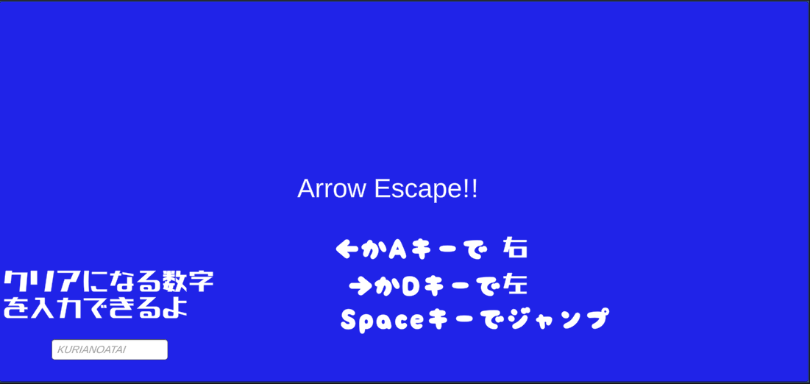
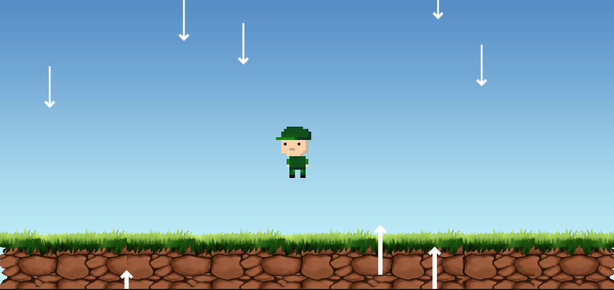
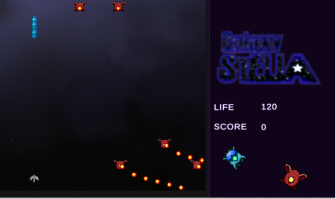

# 大見出し
## 中見出し
### 小見出し

本文。

**太字**
*斜体*(日本語は無効なことが多い)
~~取り消し~~
**太字と**__syati__
下付き
上付き
<ins>下線</ins>
<b>HTMLにも使える</b>

> 引用

`git status`を使うと、追加されたり、変更した個所を表示します。

## 作成者
 -佐久間悠生
 -専門学校デジタルアーツ東京ゲーム学科ゲームプログラムコース(2026年度卒業予定)
  
# 資格
-パソコン利用者技術検定2級 2023年7月取得  
# 習得スキル
-C# 
利用歴3年
 ・VisualStudioを用いて処理プログラムを作成可能 
-Unity 
・利用歴一年半
 
-自主ゲーム・チームの制作経験あり 
-C++ 
-利用歴半年 
-コンソールを用いて簡単なプログラムを開発 
-HTML 
-利用歴半年
 
簡単なWebページを作成可能 ----------------------------------  
# 現在の状況
-Unityを用いた自主ゲームの制作
 --------------------------------------  
# 作品リスト
## -ArrowEscape!! 

ランダムに上下から出現する障害物(矢)を十字キーの左右移動とスペースキーのジャンプで避けるゲームです。 (クリアになるまで避ける矢の本数を自分で設定可能) 
 ----------------------------------------------------------------- 
- 開発環境 :Unity + VisualStudio2022 
- 実行環境 :Unity 2021.3.4f1 Education 
- 開発期間 :2024/8/19〜2024/8/30 
- 自主製作作品。DATフェスタにて展示。  
## -GALAXYSTELLA 

 -開発環境 :Unity2020.3.4f1 
-開発期間 :2024/9/5-11/9 
グループ開発作品。DATフェスタにて展示。 他2名と協力して開発。特にプレイヤーとボスの移動システムを作成。 
----------------------------------------------------------------- 

# 連絡先 
- G-mail   [misodmp.byke083@gmail.com](misodmp.byke083@gmail.com)
